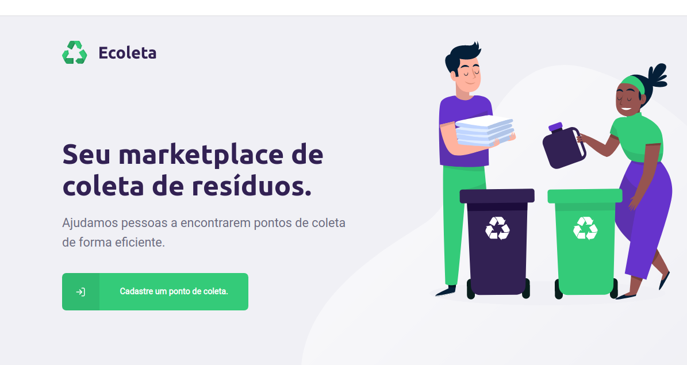
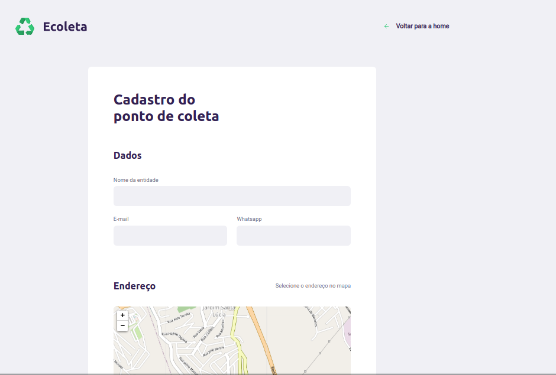
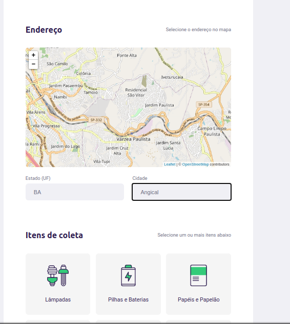

# Ecoleta
Projeto desenvolvido na next level week da rocketseat , com as tecnologias nodejs e react.

## Instalar a aplicação

```
//server

npm install
npx ts-node-dev src/server.ts
```

```
//web

npm install
yarn start
```

## Projeto Final

### Home



### Cadastro de ponto de coleta


### Geolocalização
